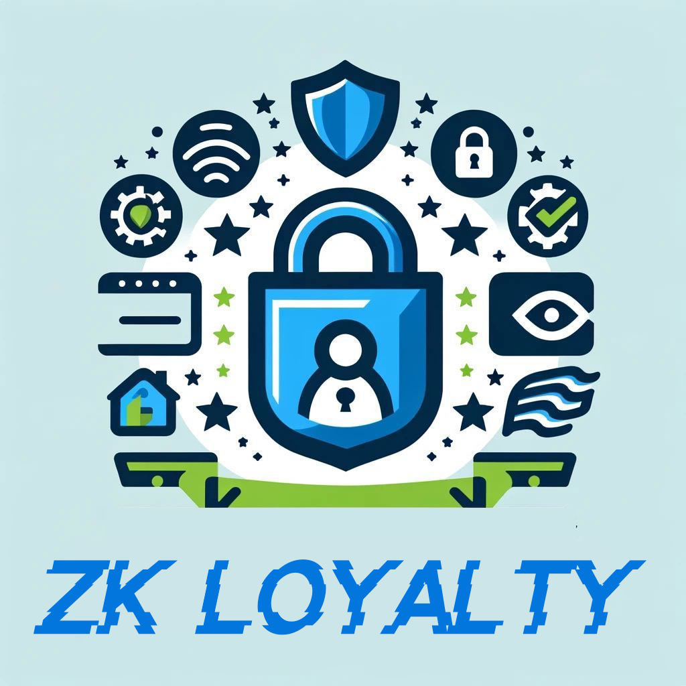

  <h1 align="center">zk loyalty</h1>
  <h3>Unlock Customer Loyalty with Privacy at its Core.</h3>
   
  <b><a href="https://taikai.network/cryptocanal/hackathons/ethdam2024/projects/cluxue9cx00s9vq01twk54w31/idea">TAIKAI</a> 
    | <a href="https://zkloyalty-enterprise.vercel.app/">Deployment Enterprise</a>
    | <a href="https://zkloyalty-consumer.vercel.app/">Deployment Customer</a>
  </b>

 

## Introduction
Zk loyalty offers a unique solution to small shops looking to increase customer retention without compromising their customers' privacy.
Built on advanced cryptographic protocols, our system ensures that customer rewards can be managed and redeemed with complete anonymity.

## Features
- GDPR Compliant: Ensures all customer data is handled legally and ethically.
- Zero Knowledge Technology: Utilizes the Semaphore protocol for managing user groups while preserving privacy.
- Easy Integration: Simple QR code scanning to add customers to the loyalty program.
- Secure Reward System: Customers can check and redeem their points without revealing their identity.
- Cross-Store Points: Enables a loyalty network among multiple stores, increasing the utility and attractiveness of the loyalty program.

## Roadmap
- Alpha Release: Implement basic user group functionality and QR code integration.
- Beta Release: Enhance security features and expand testing with selected local shops.
- Full Launch: Implement cross-store points and full GDPR compliance.

## Contributing
We welcome contributions from the community! Please check out our contributing guidelines for how to proceed.

## License
zk Loyalty is made available under the MIT License.

## Contact
For any inquiries, please reach out to us on discord @nyyls.eth.
